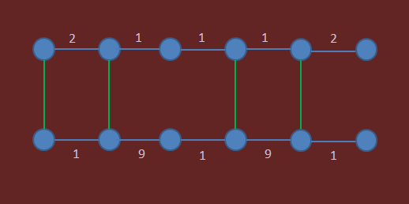

# [BridgeBuildingDiv2](http://community.topcoder.com/tc?module=ProblemDetail&rd=16464&pm=13546)
*Single Round Match 661 Round 1 - Division II, Level Two*

## Statement
You have two rows of nodes.
Each row contains N nodes, numbered 0 through N-1 from the left to the right.

Within each row, adjacent nodes are already connected by edges.
You are given the lengths of these edges as int[]s *a* and *b*, each containing N-1 elements.
For each valid i, *a*[i] is the length of the edge between nodes i and (i+1) in the top row, and *b*[i] is the length of the edge between nodes i and (i+1) in the bottom row.

You want to add exactly *K* new edges to this graph.
Each of the new edges must be vertical -- i.e., it must connect some vertex i in the top row to the vertex i in the bottom row.
All new edges will have length 0.

By adding the *K* new edges we will produce a connected graph.
The diameter of this graph is the maximum of all shortest distances among pairs of its nodes.
In other words, the diameter is the smallest number D such that it is possible to travel from any node to any other node using a path of length D or less.

Given *a*, *b*, and the int *K*, compute and return the smallest possible diameter of the resulting graph.

## Definitions
- *Class*: `BridgeBuildingDiv2`
- *Method*: `minDiameter`
- *Parameters*: `int[], int[], int`
- *Returns*: `int`
- *Method signature*: `int minDiameter(int[] a, int[] b, int K)`

## Constraints
- N will be between 2 and 11, inclusive.
- a,b will contain exactly N-1 elements each.
- *K* will be between 1 and N, inclusive.
- Each element of a,b will be between 1 and 50, inclusive.

## Examples
### Example 1
#### Input
<c>[2,1,1,1,2], [1,9,1,9,1], 4</c>
#### Output
<c>6</c>
#### Reason
One example of an optimal solution is to draw the bridges as follows:

### Example 2
#### Input
<c>[1,50,1,50,1,50,1,50], [50,1,50,1,50,1,50,1], 9</c>
#### Output
<c>8</c>
### Example 3
#### Input
<c>[50,10,15,31,20,23,7,48,5,50], [2,5,1,8,3,2,16,11,9,1], 3</c>
#### Output
<c>124</c>
### Example 4
#### Input
<c>[2,4,10,2,2,22,30,7,28], [5,26,1,2,6,2,16,3,15], 5</c>
#### Output
<c>54</c>

